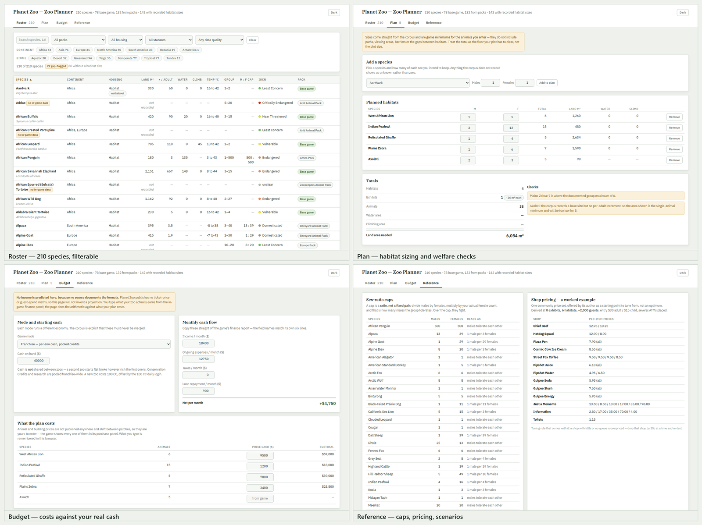

# Planet Zoo — Hintforge Companion

A spoiler-controlled hint companion for **Planet Zoo**, Frontier's wildlife management sim where you design habitats, breed species, and build the zoo of your dreams across career scenarios and sandbox. Built in the [Hintforge](https://github.com/hintforge/builder) format: a loyal sidekick that answers only from these guide files — never from guesswork — at the spoiler level you set.

## Use it

You need a Hintforge reader running in Claude Code, Codex, or OpenClaw. Point it at this repo:

> Load the Planet Zoo guide from github.com/hintforge/planet-zoo

Then just ask — *"what habitat does a snow leopard need," "how do I breed red pandas," "what are the career scenario goals."* Runtime setup lives in [`hintforge/reader`](https://github.com/hintforge/reader).

## Spoilers

**You** set two independent dials — enemy warnings (Tier 0–5) and puzzle/decision warnings (Tier 0–3) — both **silent by default**; the guide volunteers nothing until you raise one. Planet Zoo is a sandbox sim, so these dials are near-dormant — the real spoiler surface is career-scenario objectives and outcomes, gated by the puzzle dial. There's no save-state reader, so every answer comes from this guide's files.

## What's inside

A structured Markdown corpus — core mechanics (welfare, conservation, economics, breeding, staff, guests), a 210-species bestiary covering habitat requirements and welfare needs across the base game and 21 DLC packs, career scenarios, controls, settings, and achievements. The companion reads and writes only the files you control.

## Zoo Planner

A self-contained planner built from this corpus — [`artifacts/zoo_planner.html`](artifacts/zoo_planner.html). Download it, open it in any browser, keep it beside the game. Nothing is installed and nothing leaves your machine.

- **Roster** — all 210 species in one sortable table: land, water and climbing area, temperature band, group size, sex-ratio cap, biome, diet, mixing, conservation status and pack. Filter by any of them.
- **Plan** — add species with the sex split you intend to keep; it totals the area the game will demand and flags sex-ratio breaches and group sizes outside the documented range.
- **Budget** — the four game economies kept apart, your cash and finance-report figures in, what the plan costs out.
- **Reference** — sex-ratio caps, a worked shop-pricing example, an opening playbook, and the career medal objectives.

**It does not predict your income.** Planet Zoo publishes no ticket-price or guest-spend formula and nobody has reverse-engineered one, so the budget tab asks for the figures your own finance report already shows rather than dressing a guess up as a projection. Where the corpus has no figure the cell reads *not recorded*, never zero — habitat sizes exist for 142 of the 210 species, and the tool tells you which are missing instead of quietly leaving them out.

Rebuild it after a corpus change with `python build.py` in [`artifacts/`](artifacts/).
